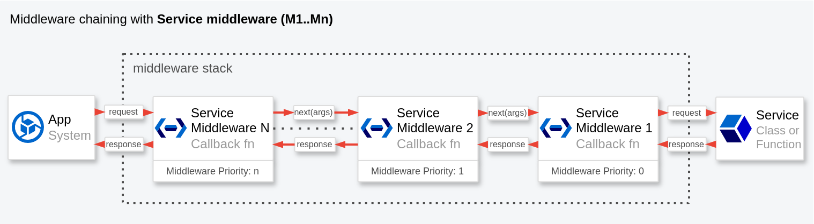
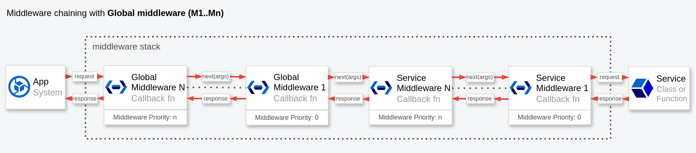
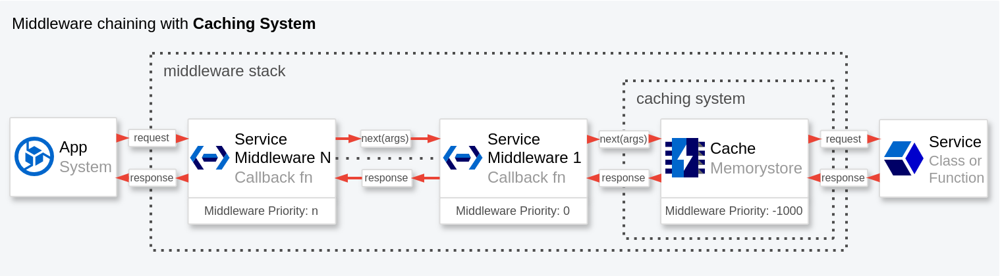

# Packet.js DI


[](https://www.npmjs.com/package/packetjs-di)
[](https://packagephobia.com/result?p=packetjs-di)
[](https://bundlephobia.com/package/packetjs-di@latest)
[](https://bundlephobia.com/package/packetjs-di@latest)
[](https://bundlephobia.com/result?p=packetjs-di)
[](https://npm-stat.com/charts.html?package=packetjs-di)
[](https://github.com/fdosruiz/packetjs/actions)
[](https://github.com/fdosruiz/packetjs/blob/main/LICENSE)
[](https://coveralls.io/github/fdosruiz/packetjs?branch=main)
[](https://snyk.io/test/npm/packetjs-di)

**Packet.js DI** is a lightweight Dependency Injection container written in TypeScript and made for JavaScript
applications like Node.js, Angular, React, Vue, Vanilla JS, etc.

**Packet.js** is designed to be simple, powerful and easy to use. It provides a lightweight and efficient way to manage
dependencies in your JavaScript/Node applications. With its lazy loading feature, it only instantiates services when
they are actually needed, improving performance and reducing memory usage.

Additionally, it supports both object-oriented programming and functional programming, making it versatile and adaptable
to different coding styles. Whether you're building a small application or a large-scale project, **Packet.js** can help
you organize and manage your dependencies effectively.

The main features of Packet.js are:

- **Lazy loading**: It only instantiates services when they are actually needed, improving performance and reducing
  memory usage.
- **Object-oriented and Functional programming**: It supports both object-oriented and functional programming, making it
  versatile and adaptable to different coding styles.
- **Dependency injection**: It provides a simple and flexible way to manage Dependency Inversion or Inversion of
  Control (IoC), which helps to improve the design and uncoupling of the application components.
- **Middleware management**: It intercepts and modifies requests and responses from the services, before they are sent
  to the next service in the middleware chain, which can be very useful for correction and error management, adding new
  features, etc.
- **Caching**: It provides a caching service that can be used to improve the performance of your application.
- **Global container**: Provides a way to retrieve the global container across the application through the import
  statement.
- **Performant**: It is designed with focus on performance and memory usage.

## Table of Contents

- [Installation](#installation)
- [Importing](#importing)
- [Basic Usage](#basic-usage)
- [Global Container](#global-container)
- [Registering Services](#registering-services)
- [Getting Services](#getting-services)
    - [`get(key, options)`](#getkey-options)
    - [`getAll(options)`](#getalloptions)
    - [`getFactory(key, options)`](#getfactorykey-options)
- [Adding Properties](#adding-properties)
- [Injecting Dependencies](#injecting-dependencies)
- [Middleware](#middleware)
    - [Middleware Stack](#middleware-stack)
    - [Next Function](#next-function)
    - [Interception and Modification](#interception-and-modification)
- [Registering Middleware](#registering-middleware)
    - [`middleware.add(key, middleware, options)`](#middlewareaddkey-middleware-options)
    - [`middleware.addGlobal(middleware, options)`](#middlewareaddglobalmiddleware-options)
- [Middleware Example Using Axios](#middleware-example-using-axios)
- [Caching/Memoization](#cachingmemoization)
    - [Caching All Methods](#caching-all-methods)
    - [Caching Only For Specific Methods](#caching-only-for-specific-methods)
    - [Caching All Methods Except Specific Ones](#caching-all-methods-except-specific-ones)
    - [No Caching](#no-caching)
- [Typescript](#typescript)
    - [`get<T>(key, options)`](#gettkey-options)
    - [`getFactory<T>(key, options)`](#getfactorytkey-options)
    - [`getAll<T>(options)`](#getalltoptions)
    - [`getProps<T>()`](#getpropst)
- [Considerations](#considerations)
    - [React Hooks Considerations](#react-hooks-considerations)
    - [Service Middleware Considerations](#service-middleware-considerations)
    - [Global Middleware Considerations](#global-middleware-considerations)
    - [Caching and Pure Functions Considerations](#caching-and-pure-functions-considerations)
    - [Service Locator Considerations](#service-locator-considerations)
- [API Reference](#api-reference)
    - [Container API](#container-api)
    - [Middleware API](#middleware-api-containermiddleware)
- [Examples](#examples)
- [Support](#support)
- [Credits](#credits)
- [License](#license)

## Installation

Using npm:

    npm i packetjs-di

Using yarn:

    yarn add packetjs-di

## Importing

```javascript
// Using Node.js `require()`
const { default: packetJsDi, Container } = require('packetjs-di');

// Using ES6 imports
import packetJsDi, { Container } from 'packetjs-di';
```

> **packetJsDi** variable is the global instance of the container.

## Basic usage

Register a service:

```javascript
// file container.config.ts (js or ts) 
import { Container } from 'packetjs-di';

const container = new Container();

container.add('Service', () => {
  return new SomeService();
});

export default container;
```

Get the service in the application:

```javascript
import container from 'container.config';

const service = container.get('Service'); // Instantiate the service
```

With typescript:

```typescript
import container from 'container.config';
import { Service } from "./@types";

const service = container.get<Service>('Service');
```

> Generic types are supported. This allows you to use the `get()` method with your own types. For more information,
> see the [Typescript](#typescript) section.

## Global Container

Getting the global container:

```javascript
import { Container } from 'packetjs-di';

const globalContainer = Container.getContainer();
```

You can also get the global container using the import statement:

```javascript
// Import the global container as the variable packetJsDi
import packetJsDi from 'packetjs-di';
```

Register a service using the global container from the import statement:

```javascript
import packetJsDi from 'packetjs-di';

packetJsDi.add('Service', () => {
  return new SomeService();
});
```

Get the service in the application using the global container from the import statement:

```javascript
import packetJsDi from 'packetjs-di';

const service = packetJsDi.get('Service'); // Instantiate the service
```

> In both cases, `packetJsDi` will always have the same global instance of the container. Except in environments
> rendered in SSR vs CSR, like Next.js, Angular, etc., where the container instance may be different depending on the
> rendering environment.

## Registering services

The `add()` method allows you to register each service in the container.

```javascript
container.add(key, callback, options);
```

The most basic example is the following (Object-oriented programming):

```javascript
container.add('Service', () => new Service());
```

And, for example, with a **React** custom hook (Functional programming):

```javascript
container.add('useCustomHook', () => useCustomHook()); 
```

> Note that the service statement must be wrapped in a callback function, and in both cases, should return an instance
> of the class or the function.

> See **[React Considerations](#react-hooks-considerations)** for more information about React hooks and singleton
> option.

By default, the singleton option is enabled. To disable it, use the `singleton` option:

```javascript
container.add('Service', () => new Service(), { singleton: false });
```

> This disables the singleton option for the service's `get()` method, and it is equivalent to using the `getFactory()`
> method instead.

Caching is disabled by default. To enable it, use the `cache` option:

```javascript
container.add('Service', () => new Service(), { cache: true });
```

> See more information for caching in the [Caching/Memoization](#caching-memoization) section

You can also protect the service statement from changes by using the `freeze` option:

```javascript
container.add('Service', () => new Service(), { freeze: true });
```

By default, the registered services are not protected. This means that if you declare the same service twice, the second
one will overwrite the first one.

```javascript
container.add('Service', () => new Service1());
container.add('Service', () => new Service2());

container.get('Service'); // new Service2() will be returned
```

> With the `freeze` option enabled, the service statement will be protected from changes, and the service cannot be
> modified. This is useful for services that you want to protect from any changes once they are set up.

> More details about the `add()` method can be found in the [Container API](#container-api)

## Getting services

### `get(key, options)`

The usual way to get a service is using the `get(key)` method:

```javascript
const service = container.get('Service');
```

- `options`: `{ proxyMiddleware: boolean }`. See the [Container API](#container-api) for more details.

> This instantiates the service only the first time, and returns the same instance for each subsequent call.
> `Singleton` option is enabled by default in the registration `add()` method.

### `getAll(options)`

The `getAll()` method returns an object with all the services registered in the container:

```javascript
const services = container.getAll();
```

- `options`: `{ proxyMiddleware: boolean }`. See the [Container API](#container-api) for more details.

> `getAll()` does not instantiate any of the services. It only returns a callback function for each service that will
> make the service instance when called.

Then, with this object, we can apply different techniques to get each service:

**Destructuring**

```javascript
const { Service1, Service2 } = container.getAll();

const instance1 = Service1(); // Make the instance of the Service1. 
const instance2 = Service2(); // Make the instance of the Service2.
```

**Method chaining**

```javascript
// Instantiate Service1 and Service2.
const instance1 = container.getAll().Service1();
const instance2 = container.getAll().Service2();
```

**Global variable**

```javascript
const services = container.getAll();

const instance1 = services.Service1(); // Instantiate the Service1.
const instance2 = services.Service2(); // Instantiate the Service2.
```

### `getFactory(key, options)`

If you need a factory for the registered services, you can use the `getFactory` method, which always returns a different
instance of the service:

```javascript
const instance1 = container.getFactory('Service');
const instance2 = container.getFactory('Service');
// instance1 !== instance2
```

- `options`: `{ proxyMiddleware: boolean }`. See the [Container API](#container-api) for more details.

Instead, with `get()` method, with the default `singleton` option enabled:

```javascript
const instance1 = container.get('Service');
const instance2 = container.get('Service');
// instance1 === instance2
```

## Adding properties

You can add configuration properties, which are useful for service registration or making settings available throughout
the application.

To add properties from a file in JSON format, use the following code:

```javascript
// Add properties from some file in json format
const properties = require('./index.json');
container.addProps(properties);
```

To retrieve the properties, use the code below:

```javascript
const properties = container.getProps();
```

You can also get the properties when registering a new service as follows:

```javascript
container.add('Service', ({ props }) => {
  return new Service(props.someProperty);
});
```

To add new properties to existing ones:

```javascript
container.addProps({
  newProperty: { foo: 'bar' }
});
```

> The `addProps()` method will overwrite any existing properties that have the same name.

## Injecting Dependencies

This is the most common way to manage multiple dependencies. For instance, we'll create a service that depends on the
database and dao service.

The callback function will be passed the container and the properties: `{ container, props }`. These provide access to
any service declared in the container and retrieve configuration or project properties.

```javascript
// Configuring some service, which depends on the dao
container.add('Service', ({ container }) => {
  return new Service(container.get('dao'));
});

// Configuring the dao service, which depends on the db
container.add('dao', ({ container }) => {
  return new dao(container.get('db'));
});

// Configuring the database, which depends on the properties
container.add('db', ({ props }) => {
  return new someDatabase(
    process.env.USER,
    process.env.PASS,
    props.someConfigurationProperty
  );
});
```

> Note that with dependency injection container, the registration order for each service is irrelevant. Each registered
> service is called on demand when the main service is invoked.

Below is an example of how to use the container:

```javascript
// Instantiate each dependency on demand. Lazy instantiation.
const foo = container.get('Service').getBar(id);
// Or like this
const foo = container.getAll().Service().getBar(id);
```

In the preceding snippet, the `Service` has a single dependency. However, you can inject as many as needed:

```javascript
// Configuring a service which depends on many services
container.add('Service', ({ container }) => {
  const service1 = container.get('Service1');
  const service2 = container.get('Service2');
  const service3 = container.get('Service3');
  return new Service(service1, service2, service3);
});
```

## Middleware

The concept of middleware remains similar to other frameworks like Express, but it is adapted to intercept and modify
the requests and responses of each of the container's services, instead of handling HTTP requests.



### **Middleware Stack**

The middleware stack is a chain of functions that execute in sequence when an operation is performed on a particular
service.

Each middleware can modify the request, perform additional operations and/or modify the response.

### **`next` Function**

The `next` function is used to pass control to the next middleware in the chain and execute the underlying operation.

`next` returns the response, which can be synchronous or a promise, and which resolves with the result of the operation
or rejects with an error.

### **Interception and Modification**

The middleware can intercept the request before it is sent to the service, modify the request parameters, add additional
logic and manipulate the response after it is received.

> The middleware only intercept calls to methods or functions of previously instantiated services. But, they do not
> intercept service instantiation.
>
> Middleware with a higher priority value is executed first. Conversely, if you need to create middleware that runs
> closer to the service execution, assign it a lower priority value. Note that the priority value must be an integer.

## Registering Middleware

### `middleware.add(key, middleware, options)`

The `middleware.add()` method allows you to add a middleware to the middleware stack.

```javascript
container.middleware.add(key, middleware, options);
```

Arguments:

- `key`: Unique key for the new middleware, which should match the service name.
- `middleware`: Callback function with the signature `(next, context, args) => {}`
    - `next()`: Function that accepts args as a parameter, and is responsible for calling the next middleware in the
      stack, and return the result of calling the next middleware.
    - `context`: `{ serviceName: string, methodName: string, container: Container }`
    - `args`: The parameters array passed to the operation performed by the called method or function.
- `options`: `{ priority: number, name: string }`

> See the [Middleware API](#middleware-api-container-middleware) for more details.

The most basic example of a middleware, without any modifications, is as follows:

```javascript
container.middleware.add('Service', (next, context, args) => {
  return next(args);
});
```

> The `next()` function receives the arguments from the middleware. You can modify these arguments before calling the
> next middleware if needed.
>
> Internally, if the `next()` function is called with empty arguments, it will use the default arguments from the
> service method instead.

> See **[Middleware Considerations](#service-middleware-considerations)** for more information about using the container
> inside a middleware.

### `middleware.addGlobal(middleware, options)`

Global middleware are similar to service middleware, but they are applied to all the services in the container.



The signature of `addGlobal()` method is similar to `add()` method, without the `key` parameter:

```javascript
container.middleware.addGlobal(middleware, options);
```

> See the [Middleware API](#middleware-api-container-middleware) for more details.

The most basic example of a global middleware, without any modifications, is as follows:

```javascript
container.middleware.addGlobal((next, context, args) => {
  return next(args);
});
```

> Global middleware, which have higher priority than service middleware, are always executed first.

> See **[Global Middleware Considerations](#global-middleware-considerations)** for more information about using the
> container inside a global middleware.

# Middleware example using `axios`

The following example shows how to add a middleware to intercept the requests for the `axios` library.

First, we declare the `axios` instance to the container:

```typescript
import { Container } from 'packetjs-di';
import axios from 'axios';
import properties from './properties/index.json';
import { Properties } from './@types';

// Create the container
const container = new Container();

// Add configuration properties
container.addProps(properties);

// Add the axios service
container.add('axios', ({ props }: { props: Properties }) => {
  return axios.create({
    baseURL: props.axios.baseURL, // jsonplaceholder.typicode.com
  });
});
```

Next, we register the middleware:

```typescript
import { AxiosResponse } from 'axios';
import { Comments, HelperDefinition } from "./@types";

container.middleware.add('axios', async (next, context, args) => {
  // We can access the service name, method name and container
  const { container, methodName } = context;

  // We can override the arguments if needed
  console.log('arguments', args);

  // Call the next middleware and get the response
  const response: AxiosResponse = await next(args);

  // Here we can modify the response
  if (methodName === 'get' && response.status === 200) {
    const { data: comments }: { data: Comments[] } = response;

    // Get the Helper from the container
    const Helper = container.get<HelperDefinition>('Helper');

    // Update comments by reference
    comments.forEach((comment) => {
      comment.random = Helper.getRandom();
      comment.uniqId = Helper.getUniqId();
    });
  }

  return response;
}, {
  priority: 1,
  name: 'axiosService'
});
```

> The context object contains information about the service name, method name and container. You can get any service
> declared in the container through the Container instance using the `get()`, `getAll()` or `getFactory()` methods.

Here's how to make the request that will be processed by the middleware:

```typescript
const axios = container.get<Axios>('axios');

axios.get('/comments').then(({ data: comments }) => {
  console.log(comments);
});
```

## Caching/Memoization

The dependency injection container is able to cache the methods or functions of each service, which significantly
improves the performance of applications that call functions that are expensive to compute. It is also useful for large
applications that make multiple calls to methods or functions that perform the same operation over and over again.

The caching system is implemented on a middleware with the lowest priority, allowing the middleware to execute as close
to the service execution as possible.



> See **[Pure Functions Considerations](#caching-and-pure-functions-considerations)** for more information about using
> the caching system with non-pure functions.

### Caching all methods

To enable the caching for all methods, you can use the `cache` option when registering the service:

```javascript
container.add('Service', () => {
  return new Service();
}, { cache: true });
```

### Caching only for specific methods

With the `methods` option you can specify a list of methods that should be handled by the cache if the cache is enabled.

```javascript
container.add('Service', () => {
  return new Service();
}, {
  cache: true,
  methods: ['someMethod1', 'someMethod2'],
});
```

> This caches only the methods `someMethod1` and `someMethod2` of the service.

### Caching all methods except specific ones

With the `excludeMode` option you can specify a list of methods that should not be cached. This is useful if you have
a large number of methods and only want to exclude some of them.

```javascript
container.add('Service', () => {
  return new Service();
}, {
  cache: true,
  methods: ['someMethod1', 'someMethod2'],
  excludeMode: true,
});
```

> This caches all the methods of the service except the methods `someMethod1` and `someMethod2`.

### No caching

The default behavior, without the cache option, is to not cache any method of the service.

```javascript
container.add('Service', () => {
  return new Service();
});
```

## Typescript

Packet.js is built on top of [TypeScript](https://www.typescriptlang.org/) and supports TypeScript projects. This
section will describe how to use Packet.js with TypeScript and Generic Types.

### `get<T>(key, options)`

The `get<T>()` method returns the instance of the registered service. So, to define the type of the service, you can do
the following:

```typescript
import { Service } from './@types';

const service = container.get<Service>('Service');
```

### `getFactory<T>(key, options)`

Similar to the `get<T>()` method, the `getFactory<T>()` method returns an instance for the registered service, and the
type of the service is defined using the `getFactory<T>()` method.

```typescript
import { Service } from './@types';

const service = container.getFactory<Service>('Service');
```

### `getAll<T>(options)`

The `getAll<T>()` method returns an object with the following structure:

```typescript
{
  Service1: () => { // Logic for the registered service 1 };
    Service2: () => { // Logic for the registered service 2 };
    ...
    ...
    }
```

So, to define the type of each service, you can do the following:

```typescript
import { Service1, Service2 } from './@types';

interface ServicesMap {
  Service1: () => Service1; // Declare the type for the service 1
  Service2: () => Service2; // Declare the type for the service 2
  ...
  ...
}
```

Then we can use it like this:

```typescript
const services = container.getAll<ServicesMap>();
```

### `getProps<T>()`

The `getProps<T>()` method returns an object with the properties registered in the container. So, to define the type of
the properties, you can do the following:

```typescript
import { Props } from './@types';

const props = container.getProps<Props>();
```

## Considerations

This section outlines some of the considerations that should be taken into account when using Packet.js.

- [Caching and Pure Functions Considerations](#https://github.com/fdosruiz/packetjs/wiki/Caching-and-Pure-Functions-Considerations)
- [Service Middleware Considerations](#https://github.com/fdosruiz/packetjs/wiki/Service-Middleware-Considerations)
- [Global Middleware Considerations](#https://github.com/fdosruiz/packetjs/wiki/Global-Middleware-Considerations)
- [React Hooks Considerations](#https://github.com/fdosruiz/packetjs/wiki/React-Hooks-Considerations)
- [Service Locator Considerations](#https://github.com/fdosruiz/packetjs/wiki/Service-Locator-Considerations)

## API Reference

### Container API

| Method                        | Arguments                                                                                                                                                                                                                                                                                                                                                                                                                                                                                                                                                                                                                                                                                                                                                                                          | Description                                                                                        |
|-------------------------------|----------------------------------------------------------------------------------------------------------------------------------------------------------------------------------------------------------------------------------------------------------------------------------------------------------------------------------------------------------------------------------------------------------------------------------------------------------------------------------------------------------------------------------------------------------------------------------------------------------------------------------------------------------------------------------------------------------------------------------------------------------------------------------------------------|----------------------------------------------------------------------------------------------------|
| `constructor(options)`        | **`options:`**: `{ freeze: boolean, proxyMiddleware: boolean }`<br/>Properties: <ul><li>**freeze**: Indicates if the services in the container should be frozen (unmodifiable). By default, it is false.</li><li>**proxyMiddleware**: Indicates if the services in the container should be proxied with a middleware. By default, the proxy middleware is enabled for all services.</li></ul>                                                                                                                                                                                                                                                                                                                                                                                                      | Constructor for the container.                                                                     |
| `add(key, callback, options)` | **`key`**: Unique key for the new service or function.<br/>**`callback({ container, props })`**: Allows you to add a new service or function to the container. The callback function will receive the container and the properties as arguments.<br/>**`options`**: Configuration object for registering the service or function:<br/> `{ cache: boolean, methods: array, excludeMode: boolean, freeze: boolean }`<br/>Properties:<ul><li>**cache**: if true enable memoization.</li><li>**methods**: array of methods to be cached.</li><li>**excludeMode**: if true, exclude the methods, from methods array, for memoization.</li><li>**freeze**: if true, freeze the service registration.</li></ul>For more information about caching system see the [Caching](#caching-memoization) section. | Register a new service or function to the container.                                               |
| `get(key, options)`           | **`key`**: Unique key of the service or function to get.<br/>**`options`**: `{ proxyMiddleware: boolean }`<br/>Properties: <ul><li>**proxyMiddleware**: if false, disable the proxy middleware. By default, the proxy middleware is enabled.</li></ul>                                                                                                                                                                                                                                                                                                                                                                                                                                                                                                                                             | Always gets the same instance for a concrete service. (singleton option enabled)                   |
| `getAll(options)`             | **`options`**: Same as `get(key, options)` method.                                                                                                                                                                                                                                                                                                                                                                                                                                                                                                                                                                                                                                                                                                                                                 | Gets all services and return them as an object. Each service, of this object, is called on demand. |
| `getFactory(key, options)`    | The arguments are the same as `get(key, options)` method.                                                                                                                                                                                                                                                                                                                                                                                                                                                                                                                                                                                                                                                                                                                                          | Always gets a new instance for a concrete service.                                                 |
| `addProps(props)`             | **`props`**: Configuration properties object in **JSON** format.                                                                                                                                                                                                                                                                                                                                                                                                                                                                                                                                                                                                                                                                                                                                   |                                                                                                    |
| `getProps()`                  |                                                                                                                                                                                                                                                                                                                                                                                                                                                                                                                                                                                                                                                                                                                                                                                                    | Gets the configuration properties object.                                                          |
| `getContainer()`              |                                                                                                                                                                                                                                                                                                                                                                                                                                                                                                                                                                                                                                                                                                                                                                                                    | Gets the global container. (static method)                                                         |

### Middleware API (`container.middleware`)

| Method                           | Arguments                                                                                                                                                                                                                                                                                                                                                                                                                                                                                                                                                                                                                                                                                                                                                                                                                                                                                                                                                                                                                                                                                                                                                                                                   | Description                                          |
|----------------------------------|-------------------------------------------------------------------------------------------------------------------------------------------------------------------------------------------------------------------------------------------------------------------------------------------------------------------------------------------------------------------------------------------------------------------------------------------------------------------------------------------------------------------------------------------------------------------------------------------------------------------------------------------------------------------------------------------------------------------------------------------------------------------------------------------------------------------------------------------------------------------------------------------------------------------------------------------------------------------------------------------------------------------------------------------------------------------------------------------------------------------------------------------------------------------------------------------------------------|------------------------------------------------------|
| `add(key, middleware, options)`  | **`key`**: Unique key for the new middleware, which should match the service name.<br/>**`middleware(next, context, args)`**: Callback function to register a new middleware. <ul><li>**next()**: call the next middleware in the stack, and return the result of calling the next middleware. Accepts the args as a parameter.</li><li>**context**: `{ serviceName: string, methodName: string, container: Container }` <ul><li>**serviceName**: Name of the service called.</li><li>**methodName**: Name of the method or function called.</li><li>**container**: Container instance.</li></ul></li><li>**args**: Array with the parameters from the method or function called.</li></ul><br/>**`options`**: `{ priority: number, name: string }`:<br/>Properties:<ul><li>**priority**: sets the priority of the middleware. A higher priority means that the middleware will be executed first. By default, if no priority is set, the priority of middleware will be in order of registration.</li><li>**name**: sets the name of the middleware. The name is not required. Only used for debugging purposes.</li></ul>For more information about middleware see the [Middleware](#middleware) section. | Add a new middleware to the middleware stack.        |
| `addGlobal(middleware, options)` | **`middleware(next, context, args)`**: Same as `middleware.add()` method.<br/>**`options`**: Same as `middleware.add()` method.                                                                                                                                                                                                                                                                                                                                                                                                                                                                                                                                                                                                                                                                                                                                                                                                                                                                                                                                                                                                                                                                             | Add a new global middleware to the middleware stack. |

## Examples

To see a list of practical examples of how to use Packet.js in various scenarios,
click [here](https://github.com/fdosruiz/packetjs/wiki/Practical-Examples).

## Support

If you encounter any issues or bugs while using `packetjs`, or if you have any feature requests, please feel free to
open an issue in our GitHub repository. You can report issues, track progress, and engage in discussions with the
community via the following link:

- [Submit an Issue](https://github.com/fdosruiz/packetjs/issues)

Before submitting a new issue, we encourage you to search through the existing issues to see if the problem has already
been reported or discussed. This helps reduce duplicates and allows us to address concerns more efficiently.

For any other questions or inquiries, you can also reach out to the maintainers directly through the GitHub discussion
board or contact email if available.

We appreciate your feedback and contributions to making `packetjs` even better!

## Credits

**Packet.js** is inspired by [pimple](https://github.com/silexphp/Pimple), a small PHP dependency injection container.

## License

[MIT](https://github.com/fdosruiz/packetjs/blob/main/LICENSE)

